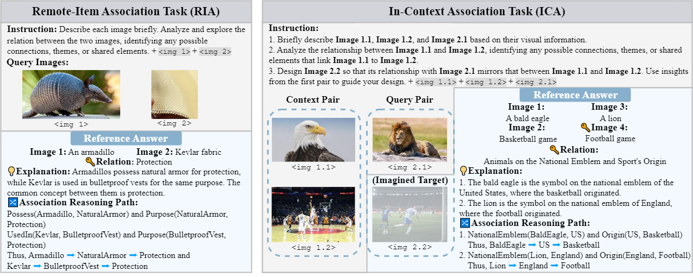
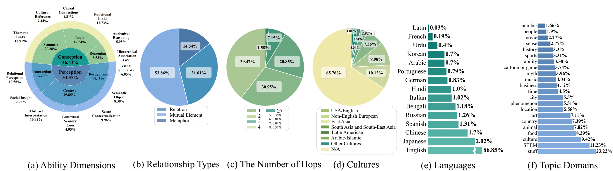

# MM-OPERA

[](https://openreview.net/forum?id=6BpKATZQd8#discussion)
[](https://huggingface.co/datasets/titic/MM-OPERA)
[](https://mm-opera-bench.github.io/)

> 🎉 **Congratulations** — our paper _“MM-OPERA: Benchmarking Open-ended Association Reasoning for Large Vision-Language Models”_ has been accepted to **NeurIPS 2025 DB Track**!  

MM-OPERA (Multi-Modal Open-Ended Reasoning-guided Association) is a benchmark designed to evaluate **association** reasoning in large vision-language models (LVLMs). It emphasizes **open-ended, multi-step reasoning** across diverse modalities and concepts, moving beyond fixed-choice tasks to probe both convergent and divergent thinking.

## 🚀 Key Highlights

* **Open-Ended Design**: Free-form answers with chained explanations, unrestricted by predefined options.
* **Two Core Tasks**:

  1. **Remote-Item Association (RIA)**: Link distant text or visual elements through a chain of thought (e.g., armadillo ↔ Kevlar via shared protective function).
  2. **In-Context Association (ICA)**: Abstract and extend associative patterns within a given context (e.g., eagle+basketball → lion+football).
* **Hierarchical Evaluation**:

  * **Levels**: From sensory perception (L‑1) to abstract reasoning (L‑3) across 13 fine-grained dimensions.
  * **Relationships**: Captures literal and symbolic links via Relation, Mutual Element, and Metaphor categories.
* **Structured Association Reasoning Paths**: Represents each multi-hop solution as a directed path; hop count reflects complexity.



## 📂 Dataset

* **Total Instances**: 11,497 (8,021 RIA + 3,476 ICA).
* **Sample Design**:

  * **RIA**: Multiple-image variants test visual sensitivity; over 25% feature unique concept pairs.
  * **ICA**: Circular evaluation—each 4‑image set yields four questions, requiring pattern abstraction and transfer.
* **Taxonomy**:

  * **L‑1 (Perception/Conception)**: Direct sensory links/abstract, knowledge-driven associations.
  * **L‑2 & L‑3**: Six and thirteen sub-dimensions creating a hierarchical framework that mirrors human cognition and enables systematic evaluation of LVLMs' capabilities in processing both sensory input and abstract reasoning.
* **Diversity**: 15 languages, 22 topic domains, and varied cultural contexts ensure broad coverage.

Dataset available on [HuggingFace](https://huggingface.co/datasets/titic/MM-OPERA).



## 🔍 Evaluation

To assess open-ended responses, MM-OPERA uses two LLM-as-a-Judge strategies:

1. **Regular Scoring** (Holistic Score):

   * **0–4 points** based on accuracy, coherence, and insight against reference chains.
   * Metrics: **Score Rate (SR)**, **High Score Rate (HR‑3/HR‑4)**, and ΔHR (divergent thinking measure).

2. **Process-Reward Scoring** (Reasoning Score):

   * Converts responses into multi-hop paths and scores each step by:
     * **Reasonableness ($R_t$)**, **Distinctiveness ($D_t$)**, **Knowledgeability ($K_t$)**.
   * Step score: \$s_t = \alpha R_tD_t + (1-\alpha) K_t\$; Path score: \$S_r = \sum_t s_t \delta^t\$.
   * Captures the quality and efficiency of the chain of thought.


## 💾 Installation
Clone this repository and set up the environment:

```bash
cd MM-OPERA
conda create -n mmopera python=3.11 -y
conda activate mmopera
pip install -r requirements.txt
```

Download the dataset:

```bash
python load_dataset.py
```

Configure `model_config.yaml` and set your API key:

```yaml
api_providers:
  provider_name:
    base_url: "https://api.example.com/v1"
    api_key_env_var: "API_KEY_ENV_VAR"

models:
  ModelName:
    model_identifier: "model-id"
    provider: "provider_name"
    endpoint: "/chat/completions"
```

Set your API key environment variable:
* **Linux/macOS:**

```bash
export API_KEY_ENV_VAR="YOUR_API_KEY"
```

* **Windows (PowerShell):**

```bash
$Env:API_KEY_ENV_VAR = "YOUR_API_KEY"
```

## ⚙️ Usage

### Remote-Item Association (RIA)

```bash
# Generate model outputs
python -m evaluation.RIA.RIA_run --model_name YourModel

# Regular LLM-as-a-Judge scoring
python -m evaluation.RIA.RIA_regular_judge --test_model_name YourModel --judge_model_name YourJudgeModel

# Process-Reward LLM-as-a-Judge scoring
python -m evaluation.RIA.RIA_reasoning_judge --test_model_name YourModel --judge_model_name YourJudgeModel
```

### In-Context Association (ICA)

```bash
# Generate model outputs
python -m evaluation.ICA.ICA_run --model_name YourModel

# Regular LLM-as-a-Judge scoring
python -m evaluation.ICA.ICA_regular_judge --test_model_name YourModel --judge_model_name YourJudgeModel

# Process-Reward LLM-as-a-Judge scoring
python -m evaluation.ICA.ICA_reasoning_judge --test_model_name YourModel --judge_model_name YourJudgeModel
```

### Statistics & Results

```bash
# RIA statistics
python -m evaluation.RIA.RIA_stat --model_name YourModel

# ICA statistics
python -m evaluation.ICA.ICA_stat --model_name YourModel
```

Logs are saved to `logs/` and results to `results/` as JSON files.

## 📝 Contributing

Contributions to MM-OPERA are welcome! Please submit issues or pull requests on the GitHub repository.

## 📜 License

MIT License. See [LICENSE](LICENSE) for details.

## ✏️ Citation

To cite, please use:

```text
@inproceedings{huang2025mmopera,
  title={{MM-OPERA: Benchmarking Open-ended Association Reasoning for Large Vision-Language Models}},
  author={Zimeng Huang and Jinxin Ke and Xiaoxuan Fan and Yufeng Yang and Yang Liu and Liu Zhonghan and Zedi Wang and Junteng Dai and Haoyi Jiang and Yuyu Zhou and Keze Wang and Ziliang Chen},
  booktitle={Advances in Neural Information Processing Systems 39},
  year={2025}
}
```


